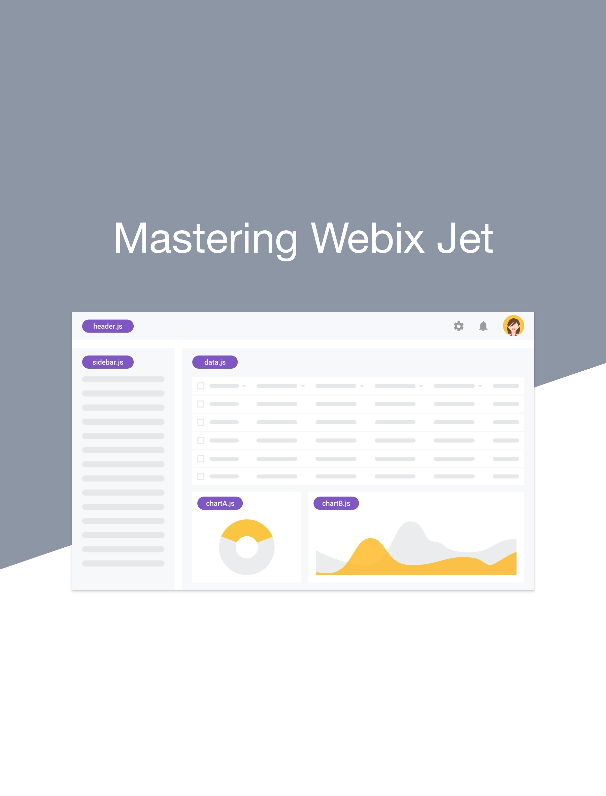

Introduction to Webix Jet
=======

*Latest update was made on November 18, 2017*

This guide provides all the information needed to start creating web applications with Webix Jet. Click <a href='https://webix.gitbooks.io/webix-jet/'>Read</a> to read the full book. The book is also [available on GitHub](https://github.com/webix-hub/gitbook-webix-jet), so you can watch the repo to get the updates.

Webix is a library of UI components and you don’t need any special techniques to create apps with it. However, while more and more components are added to a project, there’s a risk to get a mess of code. This guide will provide you with an easy and convenient way of creating apps with Webix by means of using Webix Jet framework.

