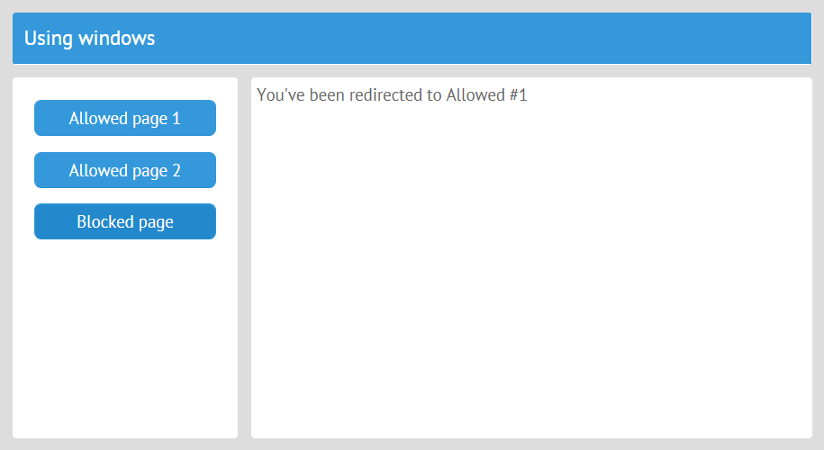

# Inner Jet Events and Error Handling

You can use a number of inner events for some additional actions if the plugins aren't enough or for error handling and debugging.
<span id="contents"></span>
- [Inner Events](#events)
- [Error Handling](#errors)

## [<span id="events">Inner Events &uarr;</span>](#contents)

| Event                         | is called     |
|-------------------------------|---------------|
| [*app:render*](#render)       | before each view of an app is rendered |
| [*app:route*](#route)         | after navigation to a view |
| [*app:guard*](#guard)         | before navigation to another view |
| [*app:user:login*](#login)    | by the _User_ plugin when a user logs in |
| [*app:user:logout*](logout)   | by the _User_ plugin when a user logs out |

### [<span id="render">app:render &uarr;</span>](#events)

The event is triggered before each view of an app is rendered. You can use it to change the initial UI config and add properties to UI controls. For instance, here is how you can disable buttons:

```js
// myapp.js
...
app.attachEvent("app:render", function(view,url,result){
    if (result.ui.view === "button")
        result.ui.disabled = true;
});
```

The event handler receives three parameters:

- **view** - the view for which the event is called
- **url** - an array of objects: the URL as an array of URL elements (each element object has such properties as *page*, *params*, and *index*) 
- **result** - a wrapper object for UI; it's created in case you want to change the UI (e.g. to put it into some other view). **result** has only one property - **ui**.

For example, you can put all the buttons in the view on a toolbar:

```js
// myapp.js
...
app.attachEvent("app:render", function(view,url,result){
    if (result.ui.view === "button")
        result.ui = {
            view:"toolbar", rows:[ result.ui ]
        };
});
```

### [<span id="route">app:route &uarr;</span>](#events)

Handling the **app:route** event resembles redefining the **urlChange()** of a class view. The event fires after navigation to a view and can be used to send notifications or sending messages to a log:

```js
// myapp.js
...
app.attachEvent("app:route", function(url){
    webix.ajax("log.php", url);
})
```

**app:route** receives one parameter - the URL as an array of URL elements (objects with three properties: *page*, *params*, and *index*).

**app:route** is used by the *Menu* plugin to highlight menu options according to the URL.

### [<span id="guard">app:guard &uarr;</span>](#events)

The **app:guard** event is triggered before navigation to another view. One of the typical cases to use this event is to create a guard: block some views and redirect users somewhere else. The **app:guard** event is used by the *UnloadGuard* plugin.

You can attach an event handler to **app:guard** like this:

```js
// myapp.js
...
app.attachEvent("app:guard", function(url, view, nav){
    if (url.indexOf("/blocked") !== -1){
        nav.redirect = "/top/allowed";
    }
})
```

The event handler receives three parameters:

- *url* - a string with the attempted URL
- *view* - the parent view that contains a subview that will be blocked
- *nav* - an object that defines navigation to the next view

**nav** has three properties:

- *redirect* is the new URL; in the example above, it's used for redirection
- *url* is the URL split into an array of element objects (each has three properties: *page*, *params*, and *index*)
- *confirm* is a promise that is resolved when the **app:guard** event is called

Suppose you have a layout with three views, one parent and two subviews (simple template views for the example). This is the parent view that has two buttons that call **show()** to render subviews:

```js
// views/top.js
import {JetView} from "webix-jet";

export default class TopView extends JetView {
    config(){
        return {
            rows:[
                { type:"wide",cols:[
                        { view:"form",  width: 200, rows:[
                            { view:"button", value:"Allowed page", click:() =>
                                this.show("allowed") },     //load "views/allowed"
                            { view:"button", value:"Blocked page", click:() =>
                                this.show("blocked") }      //load "views/blocked"
                        ]},
                        { $subview: true }
                    ]
                }
            ]
        };
    }
}
```

One of the subviews will be blocked. Let's create a guard that will block it and redirect users to the *allowed* subview. Group the views into app and attach the **app:guard** event:

```js
// myapp.js
...
app.attachEvent("app:guard", function(url, view, nav){
    if (url.indexOf("/blocked") !== -1){
        nav.redirect = "/top/allowed";
    }
});
app.render();
```

[The demo is available on GitHub >>](https://github.com/webix-hub/jet-demos/blob/master/sources/appguard.js)



### [<span id="login">app:user:login &uarr;</span>](#events)

The **app:user:login** event is called by the User plugin when a user logs in. The event handler receives one parameter - an object with user data.

```js
// myapp.js
...
app.attachEvent("app:user:login",function(user){
    webix.ajax("log.php", user);
})
```

### [<span id="logout">app:user:logout &uarr;</span>](#events)

The **app:user:logout** event is called by the User plugin when a user logs out.

```js
// myapp.js
...
app.attachEvent("app:user:logout",function(){
    app.show("loginform");  //load "views/loginform.js"
})
```

## [<span id="errors">Error Handling and Debugging &uarr;</span>](#contents)

If you include **webix_debug.js** and set the **debug** property in your app config, error messages will be logged in the console. Besides logging errors, this will enable a debugger.

```js
// myapp.js
import {JetApp} from "webix-jet";

var app = new JetApp({
    debug: true // console.log and debugger on error
});
```
<span id="error_contents"></span>
There are four events that can be used to handle errors.

| Event | is called |
|-|-|
| [app:error](#error) | any error occurs |
| [app:error:resolve](#err_resolve) | when Jet can't find a module by its name |
| [app:error:render](#err_render) | on errors during view rendering, mostly Webix UI related |
| [app:error:initview](#err_initview) | in the case of an error during view rendering, mostly Webix Jet related |

### [<span id="error">app:error &uarr;</span>](#errors_contents)

This is a common event for all errors. You can show an error message in an alert box:

```js
// myapp.js
...
app.attachEvent("app:error", function(err){
    alert("Error");
});
```

The event handler receives one parameter - the error object.

### Younger Siblings of *app:error*

Besides the common error event, there are three events for specific error types.

#### [<span id="err_resolve">Useful for End-Users &uarr;</span>](#errors_contents)

**app:error:resolve** fires when Jet can't find a module by its name. If this happens, it would be useful to redirect users somewhere else instead of showing them an empty screen:

```js
// myapp.js
...
app.attachEvent("app:error:resolve", function(err, url) {
    webix.delay(() => app.show("/some"));
});
```

The handler of **app:error:resolve** receives two parameters:

- **err** - an error object
- **url** - the URL

#### Useful for Developers

These error events are more useful for developers as they inform about errors related to the UI.

#### [<span id="err_render">app:error:render &uarr;</span>](#errors_contents)

This event is triggered on errors during view rendering, mostly Webix UI related. It means that some view UI config has been written incorrectly.

```js
// myapp.js
...
app.attachEvent("app:error:render", function(err){
    alert("Check UI config");
});
```

The event handler receives one parameter - the error object.

#### [<span id="err_initview">app:error:initview &uarr;</span>](#errors_contents)

This event is triggered in the case of an error during view rendering, mostly Webix Jet related. It means that Jet, while rendering Webix UIs, was unable to render the app UI correctly.

```js
// myapp.js
...
app.attachEvent("app:error:initview", function(err,view){
    alert("Unable to render");
})
```

The event handler receives two parameters:

- **err** - the error object
- **view** - the view that caused the error
