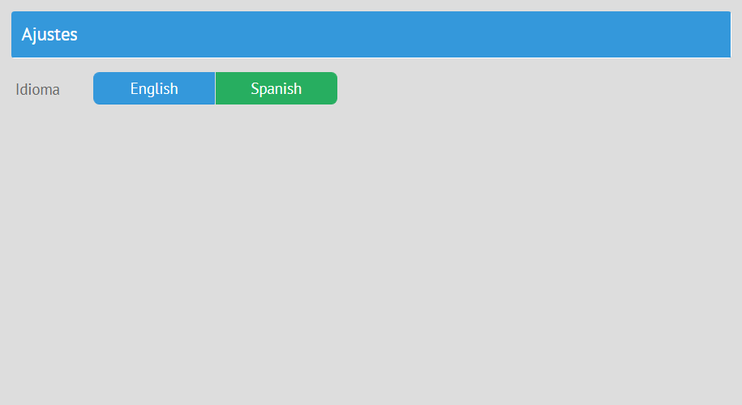

# Plugins

Webix Jet provides predefined plugins and the ability to create custom plugins.

## <span id="contents">1. Default Plugins</span>

**View Plugins**

These plugins are enabled for a specific view by *view.use()*:

- [the Menu plugin](#menu)
- [the UnloadGuard plugin](#unload)
- [the Status plugin](#status)
- [the UrlParam plugin](#urlparam)

**App Plugins**

These plugins are enabled for the whole app with *app.use()*:

- [the User plugin](#user)
- [the Theme plugin](#theme)
- [the Locale plugin](#locale)

### [<span id="menu">Menu Plugin &uarr;</span>](#contents)

The Menu plugin simplifies your life if you plan to create a menu for navigation:

- it sets subview URLs for menu options, buttons or other controls you plan to use for navigation;
- it automatically highlights the right menu option after a page reload or change of the URL. 


The plugin must be enabled in the Jet view that contains the menu with **view.use()** (call it as *this.use()*). After the plugin name, you must specify the local ID of the Webix control or widget that you want to use as a menu:

~~~js
// views/top.js
import {JetView, plugins} from "webix-jet";

export default class TopView extends JetView{
    config(){
        return {
            rows:[
                {
                    view:"menu", localId:"menu", data:[
                        { id:"details", value:"Details" },  //show "/top/details"
                        { id:"dash", value:"Dash" }         //show "/top/dash"
                    ]
                },
                { $subview:true }
            ]       
        };
    }
    init(){
        this.use(plugins.Menu, "menu");
    }
}
~~~

Subview URLs are taken either from menu option IDs or from option values if there are no IDs. If you want to change some URL, you can add custom subview URLs in the plugin configuration: 

~~~js
// views/top.js
import {JetView} from "webix-jet";

export default class TopView extends JetView {
    config(){
        return {
            rows:[
                {
                    view:"menu", localId:"menu", data:[
                        "Details",  //show "/top/demo/details"
                        "Dash"      //show "/dash"
                    ]
                },
                { $subview:true }
            ]
            
        };
    }
    init(){
        this.use(plugins.Menu, {
            id:"menu",
            urls:{
                details:"demo/details",
                dash:"/dash"
            }
        });
    }
}
~~~

[Check out the demo >>](https://github.com/webix-hub/jet-start/blob/master/sources/views/top.js)

### [<span id="unload">UnloadGuard Plugin &uarr;</span>](#contents)

The **UnloadGuard** plugin can be used to prevent users from leaving the view on some conditions. For example, this can be useful in the case of forms with unsaved or invalid data. The plugin can intercept the event of leaving the current view and e.g. show a confirmation dialogue.


The syntax for using the plugin is *this.use\(plugin,handler\)*.

```js
// views/some.js
import {JetView, plugins} from "webix-jet";
...
init(){
    this.use(plugins.UnloadGuard, function(){
        //do something
    });
}
```

*this.use()* takes two parameters:

- the plugin name
- the function that will define the behavior of the plugin

The *UnloadGuard* plugin can be used for form validation, for example. Let's have a look at a form with one input field that must not be empty:

```js
// views/form.js
import {JetView, plugins} from "webix-jet";

export default class FormView extends JetView {
    config(){
        return { 
            view:"form", elements:[
                { view:"text", name:"email", required:true, label:"Email" },
                { view:"button", value:"save", click:() => this.show("details") }
            ]
        };
    }
}
```

Let's enable the *UnloadGuard* plugin and show a confirmation window if the input is invalid:

```js
// views/form.js
...
init(){
    this.use(plugins.UnloadGuard, () => {
        if (this.getRoot().validate())
            return true;

        return new Promise((res, rej) => {
            webix.confirm({
                text: "Are you sure?",
                callback: a => a ? res() : rej()
            });
        });
    });
}
```

If the form input is not valid, the function returns a promise with a dialogue window. Depending on the answer, the promise either resolves and *UnloadGuard* lets the user go to the next view, or it rejects. No pasaran.

[Check out the demo >>](https://github.com/webix-hub/jet-demos/blob/master/sources/plugins-unload.js)

### [<span id="status">Status Plugin &uarr;</span>](#contents)

This plugin is useful if you want to show the status of data loading in case it takes time, to confirm success or to show an error message. 


These are the status messages that you can see:

- "Ok",
- "Error",
- "Connecting...".

**Status** is enabled with *this.use()* with two parameters:

- the plugin name;
- the plugin configuration (a string or an object).

The plugin configuration must contain at least the ID of the widget that will show the status. This is the simplest way to use the plugin to display the status of data loading into a datatable:

```js
// views/data.js
import {JetView, plugins} from "webix-jet";
import {data} from "models/records";
export default class DataView extends JetView{
    config(){
        return {
            rows:[
                { view:"datatable", autoConfig:true },
                { id:"app:status", view:"label" }
            ]
        };
    }
    init(view){
        view.parse(data);
        this.use(plugins.Status, "app:status");
    }
}
```

**Status** configuration can have several properties:

- **target** (string) is the ID of the widget where you want to display the status message;
- **ajax** (Boolean) enables asynchronous requests;
- **expire** (number) defines the time after which the status message disappears (by default, 2000 ms). If you set it to 0, the status message will stay as long as the view is open;
- **data** (string) defines the ID of the data component to track;
- **remote** (Boolean) enables [*webix.remote*](https://docs.webix.com/desktop__webix_remote.html) - a protocol that allows the client component to call functions on the server directly.

```js
// views/data.js
...
this.use(plugins.Status, { 
    target:"app:status",
    ajax:true,
    expire:5000
});
```

[Check out the demo >>](https://github.com/webix-hub/jet-demos/blob/master/sources/plugins-status.js)

### [<span id="urlparam">UrlParam Plugin &uarr;</span>](#contents)

The plugin allows using the URL fragments as parameters. It makes them accessible via **view.getParam()** and correctly weeds them out of the URL.

**UrlParam** is enabled with *this.use()* with two parameters:

- the plugin name;
- an array with parameter(s).

Let's consider a simple example with a parent view **some** and its child **details**:

```js
// views/some.js
import {JetView} from "webix-jet";
export default class SomeView extends JetView{
    config(){
        return {
            rows:[
                { $subview:true }
            ]
        };
    }
}

// views/details.js
const details = { template:"Details" };
export default details;
```

When loading the URL _"/some/23/details"_, you need to treat *23* as a parameter of **some**. Enable the plugin the **init()** method of **some**:

```js
// views/some.js
import {JetView,plugins} from "webix-jet";

export default class SomeView() extends JetView{
   ...
   init(){
       this.use(plugins.UrlParam, ["id"])
       // now when loading /some/23/details
       var id = this.getParam("id");//id === 23
   }
}
```

**details** will be rendered inside **some**, and the fragment *23* will be displayed in the address bar, but will not be resolved.

[Check out the demo >>](https://github.com/webix-hub/jet-demos/blob/master/sources/urlparams.js)

### [<span id="user">User Plugin &uarr;</span>](#contents)

The **User** plugin is useful for apps with authorization.


#### <span id="login_plugin">Login through a Custom Script

- [Enabling the plugin](#enable_plugin)
- [The session model](#session_model)
- [Logging in](#logging_in)
- [Logging out](#logging_out)
- [Getting user info](#getting_user)
- [Plugin configuration](#plugin_config)

##### [<span id="enable_plugin">Enabling the Plugin &uarr;</span>](#login_plugin)

To enable the plugin, call **app.use()** with two parameters:

- the plugin name,
- the plugin configuration.

The plugin configuration must contain at least the **session** model:

```js
// myapp.js
import {JetApp, plugins} from "webix-jet";
import session from "models/session";
...
app.use(plugins.User, { model: session });
```

##### [<span id="session_model">The Session Model &uarr;</span>](#login_plugin)

The plugin uses a **session** model, [check out an example](https://github.com/webix-hub/jet-start/blob/php/sources/models/session.js). The model contains requests to *php* scripts for logging in, getting the current status, and logging out. The *session* model includes the following functions:

- **status()** returns the status of the current user

```js
// models/session.js
function status(){
    return webix.ajax().post("server/login.php?status")
        .then(a => a.json());
}
```

- **login()** logs the user in, returns an object with his/her access right settings, a promise of this object or *null* if something went wrong. The parameters are:

    - *user* - username;
    - *pass* - password.

```js
// models/session.js
function login(user, pass){
    return webix.ajax().post("server/login.php", {
        user, pass
    }).then(a => a.json());
}
```

- **logout()** logs the user out:

```js
// models/session.js
function logout(){
    return webix.ajax().post("server/login.php?logout")
        .then(a => a.json());
}
```

##### [<span id="logging_in">Logging In &uarr;</span>](#login_plugin)

This is an example of a form for logging in:

```js
// views/login.js
import {JetView} from "webix-jet";

export default class LoginView extends JetView{
config(){
    return {
        view:"form",
        rows:[
            { view:"text", name:"login", label:"User Name", labelPosition:"top" },
            { view:"text", type:"password", name:"pass", label:"Password", labelPosition:"top" },
            { view:"button", value:"Login", click:()=>{
                this.do_login(); //do_login() is implemented as a class method below
            }, hotkey:"enter" }
        ],
        rules:{
            login:webix.rules.isNotEmpty,
            pass:webix.rules.isNotEmpty
        }
    };
} 
```

To implement logging in, you can use the **login()** method of the *user* service that is launched by the *User* plugin. **login()** must receive two parameters:

- the username
- the password

**login()** verifies them and if everything is fine, shows the *afterLogin* page (the start page by default). Otherwise, it shows an error message. 

Let's define the **do_login()** method of *LoginView* that will call **login()**:

```js
// views/login.js
import {JetView} from "webix-jet";

export default class LoginView extends JetView{
    ...
    do_login(){
        const user = this.app.getService("user");
        const form = this.getRoot();

        if (form.validate()){
            const data = form.getValues();
            user.login(data.login, data.pass).catch(function(){
                //error handler
            });
        }
    }
    ...
}
```

**Related demo**:

- The [complete *login.js* file](https://github.com/webix-hub/jet-start/blob/php/sources/views/login.js);
- The [demo on logging in with custom scripts](https://github.com/webix-hub/jet-start/tree/php).

##### [<span id="logging_out">Logging Out &uarr;</span>](#login_plugin)

The **logout()** method ends the current session and shows an *afterLogout* page (the login form by default).

##### [<span id="getting_user">Getting User Info & Checking the User Status &uarr;</span>](#login_plugin)

The **getUser()** method returns the data of the currently logged in user.

The **getStatus()** method returns the current status of the user. It can receive an optional Boolean parameter **server**: if it is set to *true*, the method will send an AJAX request to check the status.

The **User** service checks every 5 minutes the current user status and warns a user if the status has been changed. For example, if a user logged in and didn't perform any actions on the page during some time, the service will check the status and warn the user if it has been changed.

##### [<span id="plugin_config">Plugin Configuration &uarr;</span>](#login_plugin)

Apart from the session model, the plugin configuration can include other settings:

- **login** (string) is the URL of the login form, _"/login"_ by default;
- **logout** (string) is the URL for logging out, _"/logout"_ by default;
- **afterLogin** (string) is the URL shown after logging in, the *start* URL by default;
- **afterLogout** (string) is the URL shown after logging out, _"/login"_ by default;
- **ping** (number) is the time interval for checking the current user status, 5 minutes by default;

#### Login with an external OAuth service ( Google, GitHub, etc. )

to be continued...


### [<span id="theme">Theme plugin &uarr;</span>](#contents)

This is a plugin for changing app themes.

- [<span id="theme_contents">Enabling the Plugin</span>](#enable_theme)
- [Adding Stylesheets](#add_stylesheets)
- [Setting Themes](#setting_theme)
- [Getting the Current Theme](#getting_theme)

#### [<span id="enable_theme">Enabling the Plugin &uarr;</span>](#theme_contents)

This is how you can enable the plugin:

```js
// myapp.js
import {JetApp, plugins} from "webix-jet";
...
app.use(plugins.Theme);
app.render();
```

The plugin has two methods:

1. **getTheme()** returns the name of the current theme;
2. **setTheme(name)** takes one obligatory parameter - the name of the theme - and sets the theme for the app.

#### [<span id="add_stylesheets">Adding Stylesheets &uarr;</span>](#theme_contents)

The service locates links to stylesheets by their *title* attributes. Here are the stylesheets for the app, e.g.:

```html
<!-- index.html -->
<link rel="stylesheet" title="flat" type="text/css" href="//cdn.webix.com/edge/webix.css">
<link rel="stylesheet" title="compact" type="text/css" href="//cdn.webix.com/edge/skins/compact.css">
```

#### [<span id="setting_theme">Setting Themes &uarr;</span>](#theme_contents)

You need to provide a way for users to choose a theme. For example, let's add a segmented button:

```js
// views/settings.js
import {JetView} from "webix-jet";

export default class SettingsView extends JetView {
    config(){
        return {
            type:"space", rows:[
                { template:"Settings", type:"header" },
                { name:"skin", optionWidth: 120, view:"segmented", label:"Theme",
                    options:[
                        { id:"flat-default", value:"Default" },
                        { id:"flat-shady", value:"Shady" },
                        { id:"compact-default", value:"Compact" }
                    ], click:() => this.toggleTheme() /* not implemented yet, will be a method of this class */
                }
                {}
            ]
        };
    }
}
```

The option IDs of the segmented have two parts. The first part must be the same as the *title* attribute of the link to a stylesheet. The **theme** service gets the theme name from this part of the ID, locates the correct stylesheet and sets the theme.

Let's implement toggling themes as a method of the *SettingsView* class. The **queryView** locates the segmented by its name and gets the user's choice. After that, the service sets the chosen theme by adding a corresponding CSS class name to the body of the HTML page. 

```js
// views/settings.js
import {JetView} from "webix-jet";

export default class SettingsView extends JetView {
    ...
    toggleTheme(){
        const themes = this.app.getService("theme");
        const value = this.getRoot().queryView({ name:"skin" }).getValue();
        themes.setTheme(value);
    }
}
```

#### [<span id="getting_theme">Restoring The State of the Control &uarr;</span>](#theme_contents)

**getTheme()** can be used to restore the state of the segmented button after the new theme is applied. Let's get the current theme in **config()** and set the **value** of the segmented setting it to the correct value:

```js
// views/settings.js
...
config(){
    const theme = this.app.getService("theme").getTheme();
    return {
        ...
        { name:"skin", optionWidth: 120, view:"segmented", label:"Theme", options:[
            {id:"flat-default", value:"Default"},
            {id:"flat-shady", value:"Shady"},
            {id:"compact-default", value:"Compact"}
        ], click:() => this.toggleTheme(), value:theme }
        ...
    };
}
```

[Check out the demo >>](https://github.com/webix-hub/jet-demos/blob/master/sources/plugins-theme.js)

### [<span id="locale">Locale plugin &uarr;</span>](#contents)

This is a plugin for localizing apps.



- [<span id="locale_contents">Enabling the Plugin</span>](#enabling_plugin)
- [Setting the Locale](#setting_locale)
- [Applying the Locale](#applying_locale)
- [Getting the Current Locale](#getting_locale)
- [Optional Configuration for the Locale Plugin](#locale_config)

#### [<span id="locale_contents">Enabling the Plugin &uarr;</span>](#locale_contents)

This is how you can enable the Locale plugin:

```js
// myapp.js
import {JetApp, plugins} from "webix-jet";
...
app.use(plugins.Locale);
app.render();
```

You must create files with all the text labels in English and their translations in the *locales* folder. This is an example of the Spanish locale file:

```js
// locales/es.js
export default {
    "Settings" : "Ajustes",
    "Language" : "Idioma",
    "Theme" : "Tema"
};
```

#### [<span id="setting_locale">Setting the Locale &uarr;</span>](#locale_contents)

Use the **setLang()** method of the *locale* service to set the new language. **setLocale()** takes one parameter - the name of the locale file. When a user chooses a language, a locale file is located and the app language is changed. The method also calls **app.refresh()** that re-renders all the views.

Let's create a segmented button that will be used to choose languages. Note that IDs of the button options should be the same as the locale file names (e.g. "es", "en").

```js
// views/settings.js
import {JetView} from "webix-jet";

export default class SettingsView extends JetView {
    config(){
        return {
            type:"space", rows:[
                { template:"Settings", type:"header" },
                { name:"lang", optionWidth: 120, view:"segmented", label:"Language", options:[
                    { id:"en", value:"English" },
                    { id:"es", value:"Spanish" }
                ], click:() => this.toggleLanguage() }, //will be implemented as a method of this class
                {}
            ]
        };
    }
}
```

To set the locale, you need to get the value of the segmented button and pass it to **setLang()** that will set the locale. This is done in the **toggleLanguage()** method of the _SettingsView_ class:

```js
// views/settings.js
import {JetView} from "webix-jet";

export default class SettingsView extends JetView {
    ...
    toggleLanguage(){
        const langs = this.app.getService("locale");
        const value = this.getRoot().queryView({ name:"lang" }).getValue();
        langs.setLang(value);
    }
}
```

#### [<span id="applying_locale">Applying the Locale &uarr;</span>](#locale_contents)

The **\_()** method is used for translating text labels in the app. The method takes one parameter - a text string. **\_()** looks for the string in a locale file and returns the translation. E.g. _this.app.getService("locale").\_("Settings")_ will return _"Ajustes"_ if Spanish is chosen. If you need to localize a lot of text labels, it's reasonable to create a shorthand for the method:

```js
const _ = this.app.getService("locale")._;
```

Let's apply the **\_()** method to SettingsView:

```js
// views/settings.js
import {JetView} from "webix-jet";

export default class SettingsView extends JetView {
    config(){
        const _ = this.app.getService("locale")._;

        return {
            type:"space", rows:[
                { template:_("Settings"), type:"header" },
                { name:"lang", optionWidth: 120, view:"segmented", label:_("Language"), options:[
                    { id:"en", value:"English" },
                    { id:"es", value:"Español" }
                ], click:() => this.toggleLanguage() },
                {}
            ]
        };
    }
    ...
}
```

#### [<span id="getting_locale">Getting the Current Locale &uarr;</span>](#locale_contents)

The **getLang()** method returns the current language. **getLang()** can be used to restore the value of the segmented button:

```js
// views/settings.js
import {JetView} from "webix-jet";

export default class SettingsView extends JetView {
    config(){
        const lang = this.app.getService("locale").getLang();

        return {
            ...
            { name:"lang", view:"segmented", label:_("Language"), options:[
                {id:"en", value:"English"},
                {id:"es", value:"Spanish"}
            ], click:() => this.toggleLanguage(), value:lang }
            ...
        };
    }
    ...
}
```

#### [<span id="locale_config">Optional Configuration for the Locale Plugin &uarr;</span>](#locale_contents)

You can set add optional settings in the plugin config while enabling the plugin with **app.use()**:

- **path** is a subfolder (subpath) inside the *jet-locale* folder, in which you want the plugin to look for translations:

```js
// app.js
...
app.use(plugins.Locale, { path:"some" });
```

- **lang** (string) is the default language of the app, "en" by default;
- **storage** is the storage from which the locale will be restored and to which the current locale will be saved.

[Check out the demo >>](https://github.com/webix-hub/jet-demos/blob/master/sources/plugins-locale.js)


## 2. Custom Plugins

You can create a service and use it as an app-level plugin. 

```js
//helpers/state.js
export function State(app){
    const service = {
        getState(){
            return this.state;
        },
        setState(state){
            this.state = state;
        },
        state:0
    };
    app.setService("state", service);
}
```

Such services should be included into the application in the start file (e.g. _myapp.js_):

```js
//myapp.js
import {state} from "helpers/state.js";
    
const app = new JetApp({...}).render();
app.use(state);
```

And any view will be able to use it as: 

```js
{ view:"button", value:"Add new",  click:() => {
     if(!this.app.getService("state").getState())
        this._jetPopup.showWindow();
}}
```