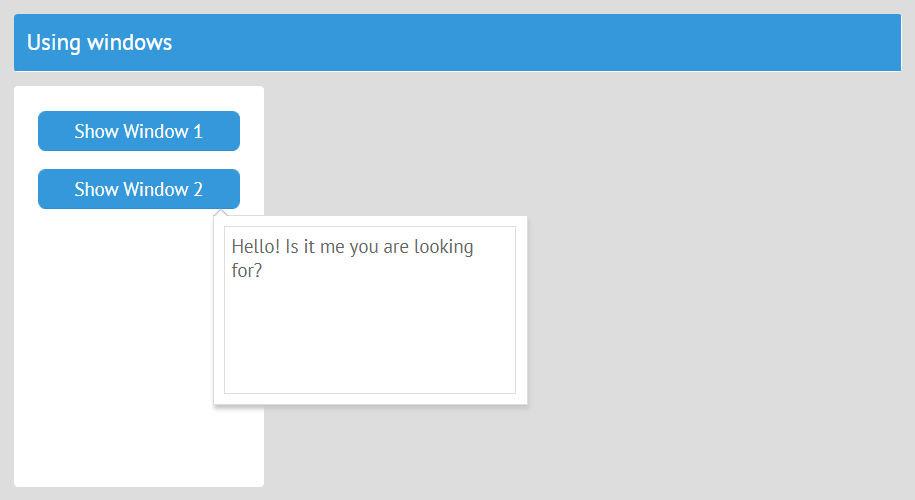

# Working with Popups and Windows



- [<span id="contents">Windows as simple views</span>](#simple)
- [Windows as Jet class views](#class)
- [Jet view embedded in the body of a window/popup](#body)

Temporary views like popups and windows can be created with **this.ui**. It returns the UI object. **this.ui** takes care of the windows it creates and destroys them when their parent views are destroyed.

### [<span id="simple">Windows as Simple Views &uarr;</span>](#contents)

Consider a simple popup view that is positioned to appear in the center of the screen:

```js
// views/window1.js
const win1 = {
	view:"popup",
	position:"center",
	body:{ template:"Text 1 (center)" }
};
export default win1;
```

Let's define a view class that will create this popup:

```js
// views/top.js
import {JetView} from "webix-jet";

export default class TopView extends JetView {
	config(){
		return {
			cols:[
                { view:"form",  width: 200, rows:[
                    { view:"button", value:"Show Window 1" }
                ]},
                { $subview: true }
            ]
        };
	}
}
```

The popus must be created in **init** of *TopView*. Add a new **win1** property to the class (*this.win1*), initialize the popup with **this.ui** and assign it to the **win1** property. **this.ui** returns a UI object with all Webix methods of the view. 

```js
// views/top.js
import win1 from "window1";
...
init(){
    this.win1 = this.ui(win1);
}
```

To show the popup, you must get the **win1** property of the class and call the **show** method of the Webix popup assigned to **win1**. This is the button click handler that shows the popup:

```js
// views/top.js

{ view:"form",  width: 200, rows:[
    { view:"button", value:"Show Window 1", click:() =>
        this.win1.show() }
]}
```

**this.win1.show** renders the popup at a position, defined in the config of the popup (*position:"center"*). If you don't set position, **win1** will be rendered in the top left corner.

### [<span id="class">Windows as Jet View Classes &uarr;</span>](#contents)

You can define windows and popups as view classes as well. Have a look at a similar popup, defined as a class:

```js
// views/window2.js
import {JetView} from "webix-jet";

export class WindowsView extends JetView {
	config(){
		return {
			view:"popup",
			top:200, left:300,
			body:{ template:"Text 2 (fixed position)" }
		};
	}
}
```

If a popup is a class view, you have to define the **showWindow** method that will call the **show** method of a Webix popup. *this.getRoot()* refers to the popup UI returned by **config**. *this.getRoot().show()* shows the popup at a fixed position on screen (*top:200, left:300*).

```js
// views/window2.js
import {JetView} from "webix-jet";

export class WindowsView extends JetView {
	config(){
		return {
			view:"popup",
			top:200, left:300,
			body:{ template:"Text 2 (fixed position)" }
		};
	}
	showWindow(){
		this.getRoot().show();
	}
}
```

To show this popup, you must call **showWindow**.

Here's how you initiate and show this class popup by **TopView** (spoiler: exactly the same way as the simple popup with some difference in concepts).

To create a popup, use **this.ui** inside **init** of **TopView**. Add a new **win2** property, create the popup with **this.ui** and assign the popup to **win2**. **this.ui** returns a class, so you can call class methods. To show the popup, call **showWindow**. 

```js
// views/top.js
import {JetView} from "webix-jet";
import WindowView from "window2";

export default class TopView extends JetView {
	config(){
		return {
			cols:[
                { view:"form",  width: 200, rows:[
                    { view:"button", value:"Show Window 2", click:() =>
                        this.win2.showWindow() }
                ]},
                { $subview: true }
            ]
        };
	}

	init(){
		this.win2 = this.ui(WindowsView);
	}
}
```

[Check out the demo on GitHub >>](https://github.com/webix-hub/jet-demos/blob/master/sources/windows.js)

### [<span id="body">Jet View Embedded in the Body of a Window/Popup &uarr;</span>](#contents)

You can also embed Jet views into the body of a window or a popup. For instance, this is the Jet class view you want to embed:

```js
// views/embeddable.js
export default class Embeddable extends JetView{
	config(){
		return {
			template:"I'm cozily inside a window"
		};
	}
}
```

To embed this view in a window, just put it into the body:

```js
// views/window3.js
import Embeddable from "embeddable";

export default class Window extends JetView{
	config(){
		return {
			view:"window", position:"center", head:"Window",
			body: Enbeddable
		}
	}
	showWindow(){
		this.getRoot().show();
	}
}
```