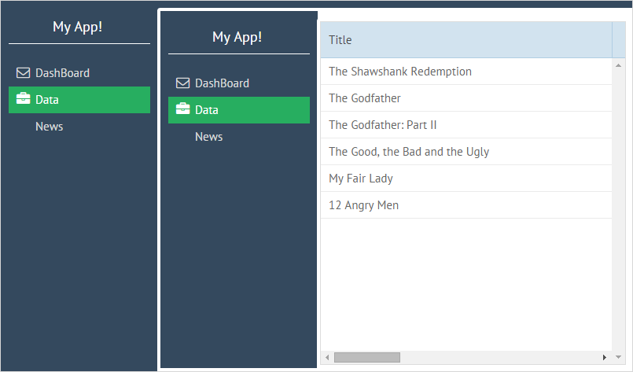

# Getting Started

## Advantages of Webix Jet

Webix Jet allows you to create flexible, easily maintainable apps, where data and visual presentations are clearly separated, interface elements can be easily combined and reused, all parts can be developed and tested separately - all with minimal code footprint. It has a ready to use solution for all kinds of tasks, from simple admin pages to fully-fledged apps with multiple locales, customizable skins, and user access levels.

Webix Jet is a fully client-side solution and can be used with any REST or [GraphQL](https://docs.webix.com/desktop__server_graphql.html)-based data API. So there are no special requirements to the server.

## How to Start

To begin with, you can grab the app package from [https://github.com/webix-hub/jet-start/archive/master.zip](https://github.com/webix-hub/jet-start/archive/master.zip) and unpack it locally. After that, run the following commands in the target folder \(this assumes that you have _Node.js_ and _npm_ installed\):

```text
npm install
npm run start
```

You can also use yarn:

```bash
yarn
yarn start
```

Next, open `http://localhost:8080` in the browser. You will see the application interface. Let's have a look at what it has inside.

## The Application Structure

The codebase of the app consists of:

* the _index.html_ file that is a start page and the only html file in the app;
* the _sources/myapp.js_ file that creates the app and contains app configuration;
* the _sources/views_ folder containing modules for interface elements;
* the _sources/models_ folder that includes modules for data operations;
* the _sources/styles_ folder for CSS assets;
* the _sources/locales_ folder for app locales \(you can ignore it for now\).

## How it Works

The basic principle of creating an app is the following. The app is a single page. It is divided into multiple views, which will be kept in separate files. Thus, the process of controlling the behavior of the app gets much easier and quicker.

Navigation between pages works, when the URL of the page changes. The URL of the app is divided by a hashbang \(\#!\) into two parts:

* the main URL that is the web address of the app,
* the app URL fragment that defines the UI \(_\#!/some/part_\).

This is a single page app, that is why only the part of the URL after the hashbang will change. The framework will react to the URL change and rebuild the interface from these elements.

The app splits the app URL into parts, finds the corresponding files in the _views_ folder and creates an interface by combining UI from those files.

For example, there are three files in the _views_ folder of the app:

* top.js
* start.js
* data.js

If you set the path to _/\#!/top/start_, the interface described in the _views/top.js_ file will be rendered first. Then the interface from _views/start_ will be added in some cell of the top-level interface:

**/\#!/top/start**


## Defining a View Module

**views/start**

The _start.js_ file describes a start page view:

```javascript
//views/start.js
export default {
    template: "Start page"
};
```

This is a module that returns a template with the text of the page.

You can look at this page by opening the URL _/\#!/start_.

**views/top**

The _views/top_ module defines the top level view, that contains a menu and includes the start page view that has been described above. Schematically, this is how **top** is defined:

```javascript
// views/top.js
import {JetView} from "webix-jet";
import start from "views/start"

export default class TopView extends JetView {
    config(){
        return {
            cols: [
                { view: "menu" },
                start
            ]
        };
    }
}
```

In the above code, there is a layout with two columns. At the top of the file, there is the list of dependencies, which will be used in this layout.

Open the path _/\#!/top_, and you will see the page with the _start_ view inside of _top_.

This module returns an object that differs from **start**. There are two variants of the return object:

* a mere description of the interface \(as in _start_\),
* a JetView-based class \(as in _top_\).

A JetView-based class can have:

* the _config\(\)_ method that returns the interface of the component that will be initialized. In this example, it's a menu;
* the lifetime handler methods that specify the component behavior during its life cycle.

## Creating Subviews

As it has already been said, the app consists of a single page. How is the process of views manipulation organized?

Check out the following code:

```javascript
//views/top.js
import {JetView} from "webix-jet";
export default class TopView extends JetView {
    config(){
        return {
            cols: [
                { view: "menu" },
                { $subview: true }
            ]
        };
    }
}
```

The line _{ $subview: true }_ implies that other modules can appear inside of the top module. The next segment of the URL after _top_ will be loaded into this structure. So for rendering the interface with a particular subview, put its name after _/\#!/top/_ -- for example _/\#!/top/start_. The _{ $subview: true }_ placeholder will be replaced with the content of a subview file \(_views/start.js_ in the above example\) and the corresponding interface will be rendered.

For example, there is a _data.js_ view, which contains a datatable. If you enter the URL _/\#!/top/data_, you will get the interface with a menu on the left and a datatable on the right:

**/\#!/top/data**


Then, add one more _/top_ subdirectory into the path. The URL will be _/\#!/top/top/data_ and the app will have another menu view inserted into the first one:

**/\#!/top/top/data**



The described way of inserting subviews into the main view is an alternative to specifying the necessary subview directly in the main view code.

For more details on including subviews and in-app navigation, read the following chapters:

* ["Creating views"](part-i-basic-usage/creating-views.md)
* ["Views and Subviews"](part-ii-webix-jet-in-details/views.md#subview-including)
* [In-App Navigation](part-i-basic-usage/in-app-navigation.md)
* [Menu Plugin](part-ii-webix-jet-in-details/plugins.md#menu-plugin)

## Loading Data with Models

While views contain the code of interfaces, _models_ are used to control the data. Let's consider data loading on the example of the _views/data.js_ file. It takes data from the _models/records_ module. **records.js** in the demo returns a data collection with local data.

```javascript
//models/records.js
export const data = new webix.DataCollection({
    data:[
        { id:1, title:"The Shawshank Redemption", year:1994, votes:678790, rating:9.2, rank:1},
        { id:2, title:"The Godfather", year:1972, votes:511495, rating:9.2, rank:2}
    ]
});
```

The module returns a data collection that loads data from the _data.php_ file.

The _views/data_ module, which uses the model, has the following code:

```javascript
//views/data.js
import {JetView} from "webix-jet";
import {data} from "models/records";

export default class DataView extends JetView {
    config() {
        return { view: "datatable", autoConfig: true }
    }
    init(view) {
        view.parse(data);
    }
};
```

This module returns a JetView-based class with two methods:

* the _config\(\)_ method that returns the interface of the component that will be initialized. In this example, it's a datatable;
* the _init\(\)_ method that specifies the component initialization behavior. When the component is created, data from the _records_ model will be loaded into it.

For more details about data loading, read:

* ["Models"](part-ii-webix-jet-in-details/models.md)

