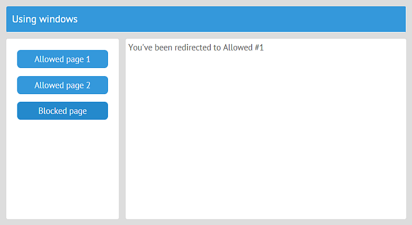

# Inner Events and Error Handling

You can use a number of inner events for some additional actions if the plugins aren't enough or for error handling and debugging.

## Calling Events

You can create custom app-wide events with the callEvent method:

```javascript
// views/top.js
import {JetView} from "webix-jet";
export default class TopView extends JetView {
    config(){
        return {
            view:"icon",
            icon:"wxi-calendar",
            click: () => this.app.callEvent("app:action:calendar", [])
        };
    }
}
```

## Attaching Event Handlers

You can use the [view.on]() to handle app events on view level:

```javascript
// views/top.js
import {JetView} from "webix-jet";
export default class TopView extends JetView {
    ...
    init(){
        this.on(this.app, "app:action:remove", id =>
            this.RemoveOption(id)
        );
    }
    RemoveOption(id){
        // remove options
    }
}
```

To handle a JetApp event on the app level, call the [app.attachEvent](jetapp-methods.md#app-attachevent) method:

```javascript
// myapp.js
...
// "app:guard" is a default app event
app.attachEvent("app:guard", function(url, view, nav){
    if (url.indexOf("/blocked") !== -1){
        nav.redirect = "/top/allowed";
    }
});
```

[View demo on GitHub &gt;&gt;](https://github.com/webix-hub/jet-demos/blob/master/sources/appguard.js)



Go to the [API Reference](jetapp-events.md) to see the full list of default app events.

## Error Handling and Debugging

If you include **webix.js** (not **webix.min.js**) and set the **debug** property in your app config, error messages will be logged in the console. Besides logging errors, this will enable the debugger.

```javascript
// myapp.js
import {JetApp} from "webix-jet";

var app = new JetApp({
    debug: true // console.log and debugger on error
});
```

You can handle error events to avoid a disaster in a production app. For example, if there is something wrong with the app URL that the user tries to access, redirect the app to something valid:

```javascript
// myapp.js
...
app.attachEvent("app:error:resolve", function() {
    webix.delay(() => app.show("/top"));
});
```

All JetApp error events:

- [app:error](jetapp-events.md#app-error) - a common event for all errors.
- [app:error:resolve](jetapp-events.md#app-error-resolve) fires when Jet can't find a module by its name.
- [app:error:render](jetapp-events.md#app-error-render) - the event that is triggered on errors during view rendering, mostly Webix UI related. It means that some view UI config has been written incorrectly.
- [app:error:initview](jetapp-events.md#app-error-initview) - the event that is triggered when there is something wrong with view rendering, mostly Webix Jet related. It means that Jet, while rendering Webix UIs, was unable to render the app UI correctly.

The last two events are mostly helpful for the development stage.
