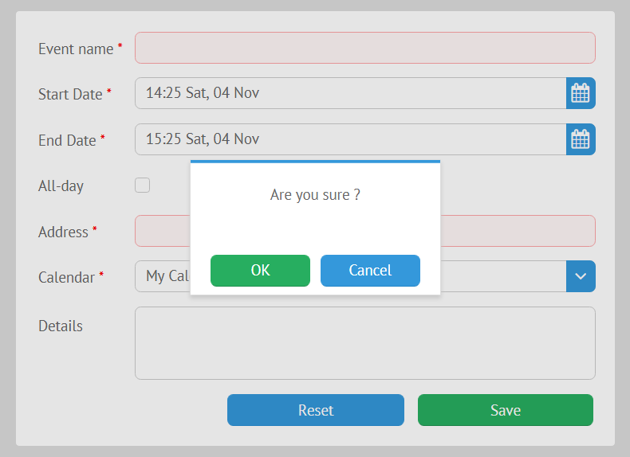
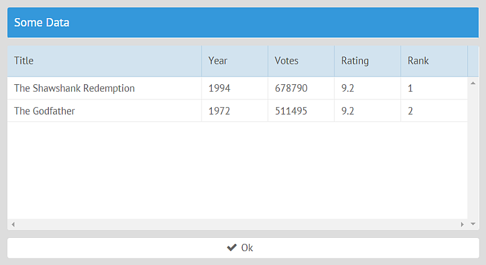
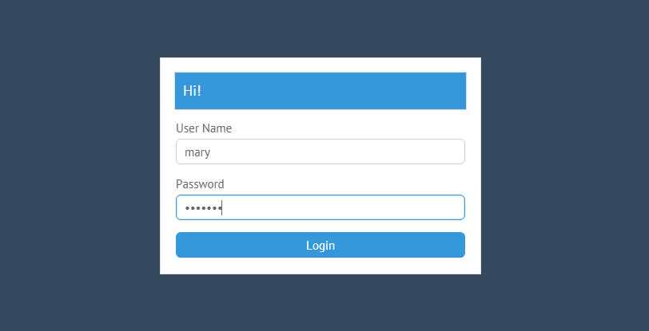

# Plugins

Webix Jet provides predefined plugins and the ability to create custom plugins.

## 1. Default Plugins

**View Plugins**

These plugins are enabled for a specific view by [view.use\(\)](jetview-api.md#this-use):

* the Menu plugin
* the UnloadGuard plugin
* the Status plugin
* the UrlParam plugin

**App Plugins**

These plugins are enabled for the whole app with [app.use\(\)](jetapp-api.md#app-use):

* the User plugin
* the Theme plugin
* the Locale plugin

### Menu Plugin

The Menu plugin simplifies your life if you plan to create a menu for navigation:

* it sets subview URLs for menu options, buttons or other controls you plan to use for navigation;
* it automatically highlights the right menu option after a page reload or change of the URL. 


The plugin must be enabled in the Jet view that contains the menu with [view.use\(\)](jetview-api.md#this-use) \(call it as _this.use\(\)_\). After the plugin name, you must specify the local ID of the Webix control or widget that you want to use as a menu:

```javascript
// views/top.js
import {JetView, plugins} from "webix-jet";

export default class TopView extends JetView{
    config(){
        return {
            rows:[
                {
                    view:"menu", localId:"menu", data:[
                        { id:"details", value:"Details" },  //show "/top/details"
                        { id:"dash", value:"Dash" }         //show "/top/dash"
                    ]
                },
                { $subview:true }
            ]
        };
    }
    init(){
        this.use(plugins.Menu, "menu");
    }
}
```

Subview URLs are taken from menu option IDs or from values if there are no IDs. If you want to change some URL, you can add custom subview URLs in the plugin configuration:

```javascript
// views/top.js
import {JetView} from "webix-jet";
export default class TopView extends JetView {
    config(){
        return {
            rows:[
                {
                    view:"menu", localId:"menu", data:[
                        { id:"details", value:"Details" },  //show "/top/demo/details"
                        { id:"dash", value:"Dash" }         //show "/top/dash"
                    ]
                },
                { $subview:true }
            ]

        };
    }
    init(){
        this.use(plugins.Menu, {
            id:"menu",
            urls:{
                details:"demo/details"
            }
        });
    }
}
```

[Check out the demo &gt;&gt;](https://github.com/webix-hub/jet-start/blob/master/sources/views/top.js)

#### Using the Plugin to Change URL Parameters

You can set the Menu plugin in the way that it does not go to a different path, but changes a certain URL parameter. Use the **param** config setting for this. **param** accepts a string with the parameter name, e.g.:

```js
// views/top.js
import {JetView} from "webix-jet";
export default class TopView extends JetView {
    config(){
        return {
            rows:[
                {
                    view:"list", localId:"users", data:[
                        { id:"1", value:"Jason Daniels" },  //show "/top?user=1"
                        { id:"2", value:"Kittie Stark" }    //show "/top?user=2"
                    ]
                },
                { /* ...UI */ }
            ]

        };
    }
    init(){
		this.use(plugins.Menu, {
			id:"users",
			param:"user"
		});
	}
}
```

If you use the Menu plugin with param setting together with the [UrlParam](#urlparam-plugin), the parameter will be displayed in the URL as a URL segment:

```js
// views/top.js
init(){
	this.use(plugins.UrlParam, ["user"]);
	this.use(plugins.Menu, {
		id:"users",
		param:"user"
	});
}

//show "/top/1"
//show "/top/2"
```

### UnloadGuard Plugin

The **UnloadGuard** plugin can be used to prevent users from leaving the view on some conditions. For example, this can be useful in the case of forms with unsaved or invalid data. The plugin can intercept the event of leaving the current view and e.g. show a confirmation dialogue.



The syntax for using the plugin is _this.use\(plugin,handler\)_.

```javascript
// views/some.js
import {JetView, plugins} from "webix-jet";
...
init(){
    this.use(plugins.UnloadGuard, function(){
        //do something
    });
}
```

[this.use\(\)](jetview-api.md#this-use) takes two parameters:

* the plugin name
* the function that will define the behavior of the plugin

The _UnloadGuard_ plugin expects a function that returns *true* if the access must be granted and *false* if not. The function can also return a promise, resolved and rejected correspondingly.

_UnloadGuard_ can be used for form validation, for example. Let's have a look at a form with one input field that must not be empty:

```javascript
// views/form.js
import {JetView, plugins} from "webix-jet";

export default class FormView extends JetView {
    config(){
        return { 
            view:"form", elements:[
                { view:"text", name:"email", required:true, label:"Email" },
                { view:"button", value:"save", click:() => this.show("details") }
            ]
        };
    }
}
```

Let's enable _UnloadGuard_ and show a confirmation window if the input is invalid. Webix confirmation windows and other modal boxes [return promises](https://docs.webix.com/desktop__message_boxes.html#modalmessageboxes).

```javascript
// views/form.js
...
init(){
    this.use(plugins.UnloadGuard, () => {
		if (this.$$("form").validate())
			return true;
		return webix.confirm({
			title:"Form is incomplete",
			text: "Do you still want to leave?"
		});
    });
}
```

If the form input is not valid, the function returns a promise. Depending on the answer, the promise either resolves and _UnloadGuard_ lets the user go to the next view, or it rejects. No pasaran.

[Check out the demo &gt;&gt;](https://github.com/webix-hub/jet-demos/blob/master/sources/plugins-unload.js)

### Status Plugin

This plugin is useful if you want to show the status of data loading in case it takes time, to confirm success or to show an error message.



These are the status messages that you can see:

* "Ok",
* "Error",
* "Connecting...".

**Status** is enabled with [this.use\(\)](jetview-api.md#this-use) with two parameters:

* the plugin name;
* the plugin configuration \(a string or an object\).

The plugin configuration must contain at least the ID of the widget that will show the status. This is the simplest way to use the plugin to display the status of data loading into a datatable:

```javascript
// views/data.js
import {JetView, plugins} from "webix-jet";
import {data} from "models/records";
export default class DataView extends JetView{
    config(){
        return {
            rows:[
                { view:"datatable", autoConfig:true },
                { id:"app:status", view:"label" }
            ]
        };
    }
    init(view){
        view.parse(data);
        this.use(plugins.Status, "app:status");
    }
}
```

**Status** configuration can have several properties:

* **target** \(string\) is the ID of the widget where you want to display the status message;
* **ajax** \(Boolean\) enables asynchronous requests;
* **expire** \(number\) defines the time after which the status message disappears \(by default, 2000 ms\). If you set it to 0, the status message will stay as long as the view is open;
* **data** \(string\) defines the ID of the data component to track;
* **remote** \(Boolean\) enables [_webix.remote_](https://docs.webix.com/desktop__webix_remote.html) - a protocol that allows the client component to call functions on the server directly.

```javascript
// views/data.js
...
this.use(plugins.Status, {
    target:"app:status",
    ajax:true,
    expire:5000
});
```

[Check out the demo &gt;&gt;](https://github.com/webix-hub/jet-demos/blob/master/sources/plugins-status.js)

### UrlParam Plugin

The plugin allows treating URL segments as parameters. It makes them accessible via [view.getParam\(\)](jetview-api.md#this-getparam) and correctly weeds them out of the URL.

**UrlParam** is enabled with [this.use\(\)](jetview-api.md#this-use) with two parameters:

* the plugin name;
* an array with parameter name\(s\).

Let's consider a simple example with a parent view **some** and its child **details**:

```javascript
// views/some.js
import {JetView} from "webix-jet";
export default class SomeView extends JetView{
    config(){
        return {
            rows:[
                { $subview:true }
            ]
        };
    }
}

// views/details.js
const details = { template:"Details" };
export default details;
```

When loading the URL _"/some/23/details"_, you need to treat the segment after **some** (_23_) as a parameter of **some**. Enable the plugin in the [init\(\)](views-and-subviews.md#init-view-url) method of **some**:

```javascript
// views/some.js
import {JetView,plugins} from "webix-jet";
export default class SomeView extends JetView{
   	...
   	init(){
		this.use(plugins.UrlParam, ["id"])
		// now when loading /some/23/details
		var id = this.getParam("id"); //id === 23
   	}
}
```

**details** will be rendered inside **some**, and the fragment _23_ will be displayed in the address bar, but will not be resolved as a view module.

[Check out the demo &gt;&gt;](https://github.com/webix-hub/jet-demos/blob/master/sources/urlparams.js)

### User Plugin

The **User** plugin is useful for apps with authorization.



#### Login through a Custom Script

This section contains guidelines for using the plugin with a custom script.

**Related demos:**

* [Demo of authorization, custom PHP script](https://github.com/webix-hub/jet-start/tree/php)
* [Webix Jet with NodeJS Express](https://github.com/webix-hub/jet-start/tree/node-express)

##### Enabling the Plugin

To enable the plugin, call [app.use\(\)](jetapp-api.md#app-use) with two parameters:

* the plugin name,
* the plugin configuration.

##### Plugin Configuration

The plugin configuration can include the following settings:

* **model** is a specific session model configured by the developer according to the requirements needed for correct authorization;
* **login** \(string\) is the URL of the login form, _"/login"_ by default;
* **logout** \(string\) is the URL for logging out, _"/logout"_ by default;
* **afterLogin** \(string\) is the URL shown after logging in, by default taken from *app.config.start*;
* **afterLogout** \(string\) is the URL shown after logging out, _"/login"_ by default;
* **user** (object) includes some default user credentials;
* **ping** \(number\) is the time interval for checking the current user status, 30000 ms by default;
* **public** (function) allows adding [pages accessible by unauthorized users](#adding-public-pages).

```js
import session from "models/session";
// ...
app.use(plugins.User, {
    model: session,
    ping: 15000,
    afterLogin: "someStartPage",
    user: { /* ... */ }
});
```

##### The Session Model

The session model should contain three main methods:

- login(),
- logout(),
- status().

Each method should return a promise.

Check out basic examples:

- [PHP](https://github.com/webix-hub/jet-start/blob/php/sources/models/session.js).
- [NodeJS Express](https://github.com/webix-hub/jet-start/blob/node-express/client/models/session.js)

Both examples are nearly identical, all requests are implemented with **webix.ajax()**.

E.g. the PHP session model contains requests to _php_ scripts for logging in, getting the current status, and logging out.

* **login\(\)** logs the user in, returns an object with user access right settings, a promise of this object or _null_ if something went wrong.

The parameters are:

* _user_ - username;
* _pass_ - password.

**login()** must return a promise of user info as a string, object or anything else that is expected.

```javascript
// models/session.js
function login(user, pass){
    return webix.ajax().post("server/login.php", {
        user, pass
    }).then(a => a.json());
}
```

* **logout\(\)** logs the user out:

```javascript
// models/session.js
function logout(){
    return webix.ajax().post("server/login.php?logout")
        .then(a => a.json());
}
```

* **status\(\)** returns the status of the current user

```javascript
// models/session.js
function status(){
    return webix.ajax().post("server/login.php?status")
        .then(a => a.json());
}
```

At this point, the User plugin will automatically redirect the user to the login page using the [built-in access guard](../part-iii-practical-tasks/jet-recipes.md#access-guard-app-level) until authorization succeeds.

##### Logging In

To implement logging in, you should call the **login\(\)** method of the plugin. Once **login()** is called and the response with some user credentials (JSON object with a name or a promise, for example) is received, the User plugin will automatically redirect the user to the specified start page and will consider the server response as user credentials.

Let's define the **do\_login\(\)** method that will call **login\(\)** from a form: 

```javascript
// views/login.js
import {JetView} from "webix-jet";
export default class LoginView extends JetView{
    config(){
		return {
			view:"form",
			rows:[
				{ view:"text", name:"login", label:"User Name" },
				{ view:"text", type:"password", name:"pass", label:"Password" },
				{ view:"button", value:"Login", click:() => {
					this.do_login();
				}, hotkey:"enter" }
			],
			rules:{
				login:webix.rules.isNotEmpty,
				pass:webix.rules.isNotEmpty
			}
		};
	}
    do_login(){
        const user = this.app.getService("user");
        const form = this.getRoot();

        if (form.validate()){
            const data = form.getValues();
            user.login(data.login, data.pass).catch(function(xhr){
                //error handler
            });
        }
    }
}
```

**Related demo**:

* The [complete _login.js_ file](https://github.com/webix-hub/jet-start/blob/php/sources/views/login.js);
* The [demo on logging in with custom scripts](https://github.com/webix-hub/jet-start/tree/php).

##### Logging Out

The **logout\(\)** method ends the current session and shows an _afterLogout_ page \(the login form by default\).

This is how you can call the method:

~~~js
this.app.getService("user").logout();
// or
this.$scope.app.getService("user").logout();
~~~

##### Getting User Info & Checking the User Status

The **getUser\(\)** method returns the data of the currently logged in user.

The **getStatus\(\)** method returns the current status of the user. It can receive an optional Boolean parameter the server: if it is set to _true_, the method will send an AJAX request to check the status.

The User plugin checks every 5 minutes (time lapse is defined by the **ping** setting of the plugin) the current user status and warns a user if the status has been changed. For example, if a user logged in and didn't perform any actions on the page during some time, the plugin will check the status and warn the user if it has been changed.

#### Adding Public Pages

By default, unauthorized users can see only the "login" page. You can add other pages that all users are allowed to access. Use the **public** setting of the plugin configuration object. **public** must be a function that returns *true* for public pages and *false* for the rest:

```js
app.use(plugins.User, {
	model: session,
	public: path => path.indexOf("top/data") > -1
});
```

#### Login with an external OAuth service \(Google, GitHub, etc.\)

If you need authorization with an OAuth service, you need to change the way to log in. **logout()** and **status()** in the session model are the same as for the custom script.

[A demo of login with passport and Google OAuth2](https://github.com/webix-hub/jet-start/tree/node-passport)

### Theme plugin

This is a plugin for changing app themes.

#### Enabling the Plugin

This is how you can enable the plugin:

```javascript
// myapp.js
import {JetApp, plugins} from "webix-jet";
...
app.use(plugins.Theme);
app.render();
```

The plugin has two methods:

1. **getTheme\(\)** returns the name of the current theme;
2. **setTheme\(name\)** takes one obligatory parameter - the name of the theme - and sets the theme for the app.

#### Adding Stylesheets

The service locates links to stylesheets by their _title_ attributes. Here are the stylesheets for the app, e.g.:

```markup
<!-- index.html -->
<link rel="stylesheet" title="flat" type="text/css" href="//cdn.webix.com/edge/webix.css">
<link rel="stylesheet" title="compact" type="text/css" href="//cdn.webix.com/edge/skins/compact.css">
```

#### Setting Themes

You need to provide a way for users to choose a theme. For example, let's add a segmented button:

```javascript
// views/settings.js
import {JetView} from "webix-jet";

export default class SettingsView extends JetView {
    config(){
        return {
            type:"space", rows:[
                { template:"Settings", type:"header" },
                { name:"skin", optionWidth: 120, view:"segmented", label:"Theme",
                    options:[
                        { id:"flat-default", value:"Default" },
                        { id:"flat-shady", value:"Shady" },
                        { id:"compact-default", value:"Compact" }
                    ], click:() => this.toggleTheme() /* not implemented yet, will be a method of this class */
                }
                {}
            ]
        };
    }
}
```

The option IDs of the segmented have two parts. The first part must be the same as the _title_ attribute of the link to a stylesheet. The **theme** service gets the theme name from this part of the ID, locates the correct stylesheet and sets the theme.

Let's implement toggling themes as a method of the _SettingsView_ class. The **queryView** locates the segmented by its name and gets the user's choice. After that, the service sets the chosen theme by adding a corresponding CSS class name to the body of the HTML page.

```javascript
// views/settings.js
import {JetView} from "webix-jet";

export default class SettingsView extends JetView {
    ...
    toggleTheme(){
        const themes = this.app.getService("theme");
        const value = this.getRoot().queryView({ name:"skin" }).getValue();
        themes.setTheme(value);
    }
}
```

#### Restoring The State of the Control

**getTheme\(\)** can be used to restore the state of the segmented button after the new theme is applied. Let's get the current theme in **config\(\)** and set the **value** of the segmented setting it to the correct value:

```javascript
// views/settings.js
...
config(){
    const theme = this.app.getService("theme").getTheme();
    return {
        ...
        { name:"skin", optionWidth: 120, view:"segmented", label:"Theme", options:[
            {id:"flat-default", value:"Default"},
            {id:"flat-shady", value:"Shady"},
            {id:"compact-default", value:"Compact"}
        ], click:() => this.toggleTheme(), value:theme }
        ...
    };
}
```

[Check out the demo &gt;&gt;](https://github.com/webix-hub/jet-demos/blob/master/sources/plugins-theme.js)

### Locale plugin

This is a plugin for localizing apps.


#### Enabling the Plugin

You can enable the _Locale_ plugin before the app is rendered:

```javascript
// myapp.js
import {JetApp, plugins} from "webix-jet";
...
app.use(plugins.Locale);
app.render();
```

You must create files with all the text labels in English and their translations in the _locales_ folder. This is an example of the Spanish locale file:

```javascript
// locales/es.js
export default {
    "My Profile" : "Mi Perfil",
    "My Account" : "Mi Cuenta",
    "My Calendar" : "Mi Calendario"
};
```

#### Changing the Default Locale

The default locale is English. You can change it while enabling the plugin:

```javascript
// app.js
app.use(plugins.Locale,{ lang:"es" });
```

#### Applying the Locale

To translate all the text labels, you need to apply the **\_\(\)** method of the service to each label. The method takes one parameter - a text string. **\_\(\)** looks for the string in a locale file and returns the translation. E.g. `this.app.getService\("locale"\).\_\("My Profile"\)` will return "Mi Perfil" if Spanish is chosen.

For example, let's apply the **\_\(\)** method to a small menu:

```javascript
// views/menu.js
import {JetView} from "webix-jet";
export default class MenuView extends JetView {
    config(){
        const _ = this.app.getService("locale")._;

        return {
            view:"menu", data:[
                { id:"profile", value:"My Profile" },
                { id:"account", value:"My Account" },
                { id:"calendar", value:"My Calendar" }
            ],
            template:(obj)=>{
                return _(obj.value)};
            }
        };
    }
}
```

#### Dynamically Changing Locales

If you want your app to be multilingual and let the users to choose a language, you can add a control for that.

To set a new language, use the **setLang\(\)** method of the _locale_ service. **setLang\(\)** takes one parameter - the name of the locale file. When a user chooses a language, a locale file is located and the app language is changed.


Do not call **setLang\(\)** in lifetime handlers of JetView! It calls [app.refresh\(\)](jetapp-api.md#app-refresh) that re-renders all the views, which will start an infinite loop.


Let's create a simple page for app settings with a segmented button that will be used to choose languages. Note that the IDs of the button options should be the same as the locale file names \(e.g. "es", "en"\).

```javascript
// views/settings.js
import {JetView} from "webix-jet";

export default class SettingsView extends JetView {
    config(){
        return {
            type:"space", rows:[
                { template:"Settings", type:"header" },
                { name:"lang", optionWidth: 120, view:"segmented", label:"Language", options:[
                    { id:"en", value:"English" },
                    { id:"es", value:"Spanish" }
                ], click:() => this.toggleLanguage() }, //will be implemented as a method of this class
                {}
            ]
        };
    }
}
```

**toggleLanguage\(\)** is a class method that will:

* get the value of the segmented button,
* pass it to **setLang\(\)** that will set the locale.

```javascript
// views/settings.js
import {JetView} from "webix-jet";
export default class SettingsView extends JetView {
    ...
    toggleLanguage(){
        const langs = this.app.getService("locale");
        const value = this.getRoot().queryView({ name:"lang" }).getValue();
        langs.setLang(value);
    }
}
```

#### Getting the Current Locale

To check the current language, use the **getLang\(\)** method. It can be useful for restoring the value of the settings control, e.g.:

```javascript
// views/settings.js
import {JetView} from "webix-jet";
export default class SettingsView extends JetView {
    config(){
        const lang = this.app.getService("locale").getLang();

        return {
            ...
            { name:"lang", view:"segmented", label:_("Language"), options:[
                {id:"en", value:"English"},
                {id:"es", value:"Spanish"}
            ], click:() => this.toggleLanguage(), value:lang }
            ...
        };
    }
    ...
}
```

[Check out the demo &gt;&gt;](https://github.com/webix-hub/jet-demos/blob/master/sources/plugins-locale.js)

#### Storing the Language

To restore the last chosen language when the app is opened again, set the **storage** setting of the plugin, e.g. you can choose the local storage:

```javascript
// app.js
...
app.use(plugins.Locale, { storage:webix.storage.local });
```

#### Path for the Locale Plugin

You can also set **path** to a subfolder \(subpath\) inside the _jet-locale_ folder, in which you want the plugin to look for translations:

```javascript
// app.js
...
app.use(plugins.Locale, { path:"some" });
```

You can also disable locale loading from *jet-locales* using the same setting:

```js
app.use(plugins.Locale, { path:false });
```

#### Combining with Webix Locales

The Locale plugin has the additional setting for using Webix locales alongside with the Jet app locale.

```js
app.use(plugins.Locale, {
	webix:{
		en:"en-US",
		// ...other locales
	}
});
// calls webix.i18n.setLocale("en-US")
```

#### Splitting Localization

If a lot of text in your app needs to be translated, you can split localizations and load them when they are needed. The source of a locale can be anything, e.g. inline or a result of an AJAX request:

```js
webix.ajax("/server/en/forms").then(data => {
    data = data.json();
    this.app.getService("locale").setLangData("en", data);
});
```

#### Configuring Polyglot

The Locale plugin uses the [Polyglot library](http://airbnb.io/polyglot.js/), which has settings of its own. You can use these settings in the config of the plugin:

```js
this.use(plugins.Locale, { polyglot:{ /* ...Polyglot settings */ } });
```

## 2. Custom Plugins

You can create a service and use it as an app-level plugin.

```javascript
//helpers/state.js
export function State(app){
    const service = {
        getState(){
            return this.state;
        },
        setState(state){
            this.state = state;
        },
        state:0
    };
    app.setService("state", service);
}
```

Such services should be included into the application in the start file \(e.g. _myapp.js_\):

```javascript
//myapp.js
import {state} from "helpers/state.js";

const app = new JetApp({...}).render();
app.use(state);
```

And any view will be able to use it as:

```javascript
{ view:"button", value:"Add new",  click:() => {
    if(this.app.getService("state").getState())
        //do something
}}
```

