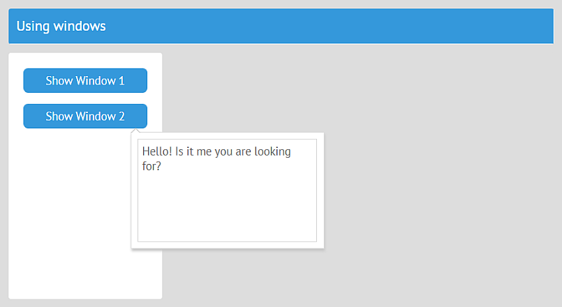

# Popups and Windows



Temporary views like popups and windows can be created with **this.ui\(\)**. It returns the UI object. **this.ui\(\)** takes care of the windows it creates and destroys them when their parent views are destroyed.

## Windows as Simple Views

Consider a simple popup view that will appear in the center of the screen:

```javascript
// views/window1.js
const win1 = {
    view:"popup",
    position:"center",
    body:{ template:"Text 1 (center)" }
};
export default win1;
```

Let's define a view class that will create this popup:

```javascript
// views/top.js
import {JetView} from "webix-jet";

export default class TopView extends JetView {
    config(){
        return {
            cols:[
                { view:"form",  width: 200, rows:[
                    { view:"button", value:"Show Window 1" }
                ]},
                { $subview: true }
            ]
        };
    }
}
```

The popup can be created in **init\(\)** of _TopView_. Add a new **win1** property to the class \(_this.win1_\), initialize the popup with **this.ui\(\)** and assign it to the **win1** property. **this.ui\(\)** returns a UI object with all Webix methods of the view.

```javascript
// views/top.js
import win1 from "views/window1";
...
init(){
    this.win1 = this.ui(win1);
}
```

To show the popup, you must get the **win1** property of the class and call the **show\(\)** method of the Webix popup. This is the button click handler that shows the popup:

```javascript
// views/top.js
...
{ view:"form",  width: 200, rows:[
    { view:"button", value:"Show Window 1", click:() =>
        this.win1.show() }
]}
```

**this.win1.show\(\)** renders the popup at a position, defined in the config of the popup \(_position:"center"_\). If you don't set position, **win1** will be rendered in the top left corner.

## Windows as Jet View Classes

You can define windows and popups as view classes as well. Have a look at a similar popup, defined as a class:

```javascript
// views/window2.js
import {JetView} from "webix-jet";

export class WindowsView extends JetView {
    config(){
        return {
            view:"popup",
            top:200, left:300,
            body:{ template:"Text 2 (fixed position)" }
        };
    }
}
```

This popup, when shown, will appear at a fixed position on screen \(_top:200, left:300_\).

Because this popup view is a class, you have to define the method \(or attach an event\) that will call the **show\(\)** method of a Webix popup.

```javascript
// views/window2.js
import {JetView} from "webix-jet";

export class WindowsView extends JetView {
    config(){
        return {
            view:"popup",
            top:200, left:300,
            body:{ template:"Text 2 (fixed position)" }
        };
    }
    showWindow(){
        this.getRoot().show();
    }
}
```

_this.getRoot\(\)_ refers to the popup UI returned by **config\(\)**.

To show this popup, you must call **showWindow**.

Here's how you initiate and show this class popup by **TopView**:

1. To create a popup, use **this.ui\(\)** inside **init\(\)** of **TopView**.
2. Add a new **win2** property, create the popup with **this.ui\(\)** and assign the popup to **win2**.
3. **this.ui\(\)** returns a class, so you can call class methods. To show the popup, call **showWindow\(\)**.

```javascript
// views/top.js
import {JetView} from "webix-jet";
import WindowView from "views/window2";

export default class TopView extends JetView {
    config(){
        return {
            cols:[
                { view:"form",  width: 200, rows:[
                    { view:"button", value:"Show Window 2", click:() =>
                        this.win2.showWindow() }
                ]},
                { $subview: true }
            ]
        };
    }
    init(){
        this.win2 = this.ui(WindowsView);
    }
}
```

[Check out the demo on GitHub &gt;&gt;](https://github.com/webix-hub/jet-demos/blob/master/sources/windows.js)

## Jet View Embedded in the Body of a Window/Popup

You can also embed Jet views into the body of a window or a popup. For instance, this is the Jet class view you want to embed:

```javascript
// views/embeddable.js
export default class Embeddable extends JetView{
    config(){
        return {
            template:"I'm cozily inside a window"
        };
    }
}
```

To embed this view in a window, import it and put it into the window body:

```javascript
// views/window3.js
import Embeddable from "views/embeddable";

export default class Window extends JetView{
    config(){
        return {
            view:"window", position:"center", head:"Window",
            body: Embeddable
        }
    }
    showWindow(){
        this.getRoot().show();
    }
}
```

## Including Windows in the app URL

Jet views inside windows can have complex structures, e.g. with several layers of subviews. In this case it would be useful to keep the UI of the window in the app URL and navigate inside the window in the same way as it is done for the rest of Jet views.

The solution is to include a view with a window as a dynamic subview. The window will still be shown above the UI of the parent, but otherwise will behave as an ordinary subview. Follow these steps:

1. create a *$subview:true* element in the parent view and add the **popup:true** property to it,
2. show the window-view with *this.show()*.

```js
// views/top.js
import { JetView } from "webix-jet";
export default class TopView extends JetView{
	config(){
		return {
			rows:[
				{
					view:"button", width: 120, value:"Data",
					click:() => this.show("popup")
				},
				{ $subview:true, popup:true }
			]
		};
	}
}
```

"popup" is the file with the window, e.g.:

```js
import { JetView } from "webix-jet";
export default class PopupView extends JetView {
	config(){
		return {
			view:"window", head:false, position:"center",
			body:{
				template:"Window with data"
			}
		};
	}
}
```

## Adding a Context Menu

You can also attach a context menu to widgets with _this.ui\(\)_.

Let's attach a context menu to a simple template. This is a Jet view with the template:

```javascript
// views/top.js
import {JetView} from "webix-jet";

export default class TopView extends JetView {
    config(){
        return {
            localId:"body", template:"A place for context"
        };
    }
}
```

The context menu will be created by _this.ui\(\)_ in _init\(\)_ of the _top_ view. After that, the context menu will be attached to the template. To reference the template, you can use its local ID:

```javascript
// views/top.js
import {JetView} from "webix-jet";

export default class TopView extends JetView {
    config(){
        return {
            localId:"body", template:"A place for context"
        };
    }  
    init(){
        var context = this.ui({
        view:"contextmenu", localId:"context",
        data:["Add","Rename","Delete",{ $template:"Separator" },"Info"]
        });
        context.attachTo(this.$$("body").getNode());
    }
}
```

To remove the context menu when its parent is destroyed, call its destructor:

```javascript
// views/top.js
...
destroy(){
    $$("context").destructor();
}
```

[Check out the example &gt;&gt;](https://webix.com/snippet/e15ae356)

