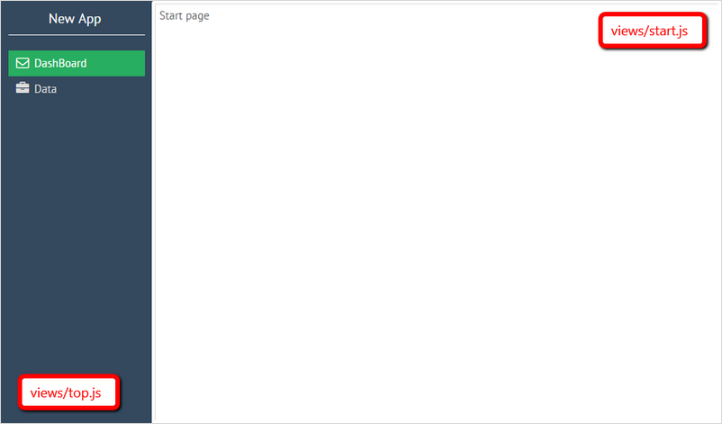

Webix is a library of UI components and you don’t need any special techniques to create apps with it. However, while more and more components are added to a project there’s a risk to get a mess of code. This guide will provide you with an easy and convenient way of creating apps with Webix by means of using Webix Jet framework.

## Advantages of Webix Jet

Webix Jet allows you to create a flexible, easy maintainable app, where data and visual presentations are clearly separated, interface elements can be easily combined and reused, all parts can be developed and tested separately - all with minimal code footprint. It has a ready to use solution for all kinds of tasks, from simple admin pages to fully-fledged apps with multiple locales, customizable skins and user access levels. 

Webix Jet is a fully client-side solution, and can be used with any REST-based data api. So there aren’t any special requirements to the server.


## Getting started

To begin with, you should grab the app package from https://github.com/webix-hub/jet-start/archive/master.zip and unpack it locally. After that, run next commands in the target folder ( this assumes that you have nodejs and npm installed )

```
npm install
npm run server
```

and open ```http://localhost:8080``` in the browser. You’ll see the app’s interface. Let’s have a look what it has inside.

## The app’s structure

The codebase of our app consists of:

- *index.html* file that is a start page and the only html file in our app
- *sources/myapp.js* file that creates the app and contains app's configuration;
- the *sources/views* folder containing modules for interface elements;
- the *sources/models* folder that includes modules for data operations;
- the *sources/styles* folder for css assets
- the *sources/locales* folder for app locales ( you can ignore it for now )

## How it works

The basic principle of creating an app is the following. The app is a single page. We divide it into multiple views which will be kept in separate files. Thus, the process of controlling the app’s behavior gets much easier and quicker.

In order to navigate between pages we will change the url of the page. But as we are writing a single page app, we will change not the main url, but only a part after hashbang. The framework will react to the url change and rebuild the interface from these elements.

The app splits the url into parts, finds the corresponding files in the views folder and creates an interface by combining UI from those files.

For example, there are next 2 files in the *views* folder of our app:

- top.js
- start.js

If you set the path to *“index.html#!/top/start”*, the interface described in the *views/top.js* file will be rendered first. Then the interface from *views/start* will be added in some cell of top level interface:

**index.html#!/top/start**



##Defining a view module

**views/start**

The *start.js* file describes a start page view

```js
//views/start.js
export default {
	template:"Start page"
};
```

This is a module that returns a template with the text of the page.

You can look at this page by opening the url *index.html#!/start*

**views/top**

The *views/top* module defines the top level view, that contains a menu and includes the start page view, which we have described above:

```js
//views/top.js

import start from "views/start"

export default {
	cols:[
		{ view:"menu" },
		start
	]
};
```

In the above code we have described a layout with two columns.
At the top of the file we are providing the list of dependencies, which we will use in this layout.

Open the path *index.html#!/top* and you’ll see the page with *start* view inside of the *top* one.

## Creating subviews

As it’s already been said, our app consists of a single page. How is the process of views manipulation organized?

Let’s check the following code:

```js
//views/top.js
export default {
	cols:[
		{ view:"menu" },
		{ $subview: true }
	]
};
```

The line *{ $subview: true }* implies that we can enclose other modules inside of the top module. The next segment of the url will be loaded into this structure. So for rendering the interface including a particular subview, put its name after *index.html#!/top/* like *index.html#!/top/start*.
The *{ $subview: true }* placeholder will be replaced with the content of a subview file ( *views/start.js* in the above example ) and the corresponding interface will be rendered.

For example, we've got a *data.js* view which contains a datatable. If you enter the url *index.html#!/top/data*, you’ll get the interface with a menu in the left part and a datatable in the right part:

**index.html#!/top/data**


Then, add one more /top subdirectory into the path. The url will look as* index.html#!/top/top/data* and the app will have another menu view inserted into the first one. This view will contain the datatable:

**index.html#!/top/top/data**


The described way of inserting subviews into the main view is an alternative to specifying the necessary subview directly in the main view code.


## Loading data with models

While views contain the code of interfaces, models are used to control the data.
We’ll consider data loading on the example of the *views/data.js* file. It takes data from the *models/records* module.To load data into the view we’ll use data collection. Take a look at the content of the records.js file:

```js
//models/records.js
export const data = new webix.DataCollection({
	url:"data.php"
});
```

In this module, we create a new data collection that loads data from the *data.php* file. The module returns a helper method that provides access to our DataCollection.

The *views/data* module has the following code:

```js
//views/data.js
import {JetView} from "webix-jet";

export default class DataView extends JetView{
	config(){
		return { view:"datatable", autoConfig:true }
	}
	init(view){
		view.parse(records.data);
	}
};
```

As you can see, this module returns an object that differs from those we described earlier. There are two variants of the return object. It can be simply a description of interface or a JetView based class, which can have:

- the *config* method, that return the interface of the component that will be initialized. In our example it’s a datatable;
- the *init* method specifies the component initialization behavior, in our case data from the records model will be loaded into the view after its creation.
